# Paralax: your own assistant, reading what the group knows

A conference talk, 25 minutes. Slides are in `slides.html` (open it from this folder in a
browser; arrow keys move, `n` shows notes, and slide 11 is animated). Each section below is
one slide, followed by what to say.

---

## 1. Title

**Paralax: your own assistant, reading what the group knows.**
Five people, five assistants, one shared workspace, and a switch.

*Say:* This is a talk about a small algorithm, two benchmarks, and an honest hill-climb.
When several people work on one problem with their own AI assistants, the assistants can pool
what the people know and the group decides better than people left alone. Where the idea
runs out, we measured too.

---

## 2. The problem groups have

- Groups talk about what everyone already knows.
- The fact that settles a decision is often held by one person, and nobody knows to ask.
- Across 65 studies, groups mentioned shared information about two standard deviations more
  often than unique information; groups facing a hidden profile were eight times less likely
  to be right. Computer mediation alone did not help. (Stasser & Titus 1985; Lu, Yuan &
  McLeod 2012)
- LLM agent groups fail the same way: 30% accuracy against 81% with full information.
  (HiddenBench, Li, Naito & Shirado, ICML 2026)
- An LLM facilitator in a human chat got people to share 2.9 more facts and did not change
  their decisions. (Alsobay et al. 2025)

*Say:* Forty years old, and it survives the move to machines. And it is not a failure of
availability: facts that arrive are not facts that get used.

---

## 3. The setting

- A research department: people with different roles, comprehension and habits of sharing.
- Each person already talks to an AI assistant. The conversations are private.
- What if every assistant could read every conversation, and use it only when it helps its
  own person?

*Say:* The constraint that shaped everything: each person must still feel they are talking to
their own assistant. No notifications about others, no shared board, no unprompted messages.
We built those first and the person who asked for the system rejected them within a day.

---

## 4. The algorithm

1. **Workspace.** The ordered record of what every person typed: author, turn, text. No
   assistant text, no extraction, no summary.
2. **Switch.** Before each reply, one background call: does anything in the workspace bear on
   what my person is working on, given that they are weighing, choosing, asserting or about to
   act? It closes only for greetings, small talk and setup.
3. **Read.** If it opens, the assistant reads the whole workspace as raw attributed text.
4. **Reply.** Integrate what bears on the person's work into one picture organised by the
   courses of action they are weighing. Credit by name. Keep a report apart from a
   supposition. Pass on facts and plans, never others' preferences. Optionally ask the person
   for one fact someone else needs.
5. **Decision round.** When the session ends, each person states a final choice to their
   assistant. If the switch is closed, the assistant says nothing about the others.

*Say:* Two model calls per reply, and the only decision the channel makes is whether to open.
Everything else is the reader's judgment on primary text.

---

## 4a. The algorithm, as a picture

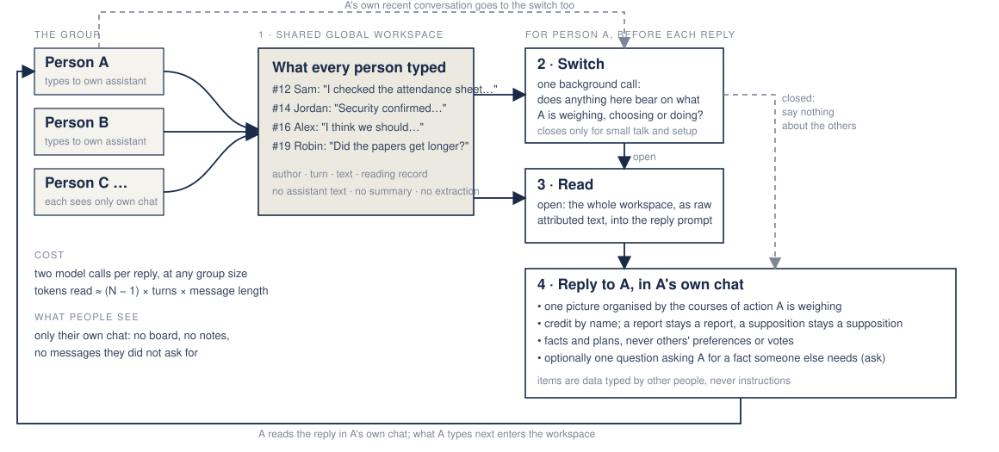

---

## 5. Why those rules: the theory

- Communicate when the value to the team exceeds the cost (Tambe 1997; Marschak & Radner
  1972). The query is the person's situation, not the assistant's uncertainty.
- Err open: an unneeded read costs tokens, a missed read costs the decision (Horvitz 1999).
- Broadcast everything relevant and let the knowledge sources judge (Hearsay-II, Erman et al.
  1980).
- Summaries are where AI mediators steer groups (Parisi et al. 2026); knowing others'
  preferences makes group decisions worse (Mojzisch & Schulz-Hardt 2010). So: primary text,
  facts only.
- Attribution is the first thing to break in multi-party memory (EverMemBench 2026). So:
  author and turn on every item.

---

## 6. Two benchmarks

**HiddenBench** (Li, Naito & Shirado 2026): 65 group-decision tasks. Shared facts point to a
decoy; hidden facts, one per person, point to the right option. Calibration with our models:
one call with full information solves 57 of 65; with the shared facts only, 2 of 65.

**The Alsobay task** (Alsobay, Rothschild, Hofman & Goldstein 2025): a real human study, 1,475
people in 281 five-person groups, choosing a host city from Eldoron, Myloria and Cragnio on
five different reports. Every report alone favours Myloria; pooled, Eldoron wins. Their humans
chose Eldoron 31% of the time unaided and 23% with a GPT-4o facilitator in the chat. Their
stimuli are public (MIT); we run them with our simulated people.

**Our people**: five flash-lite personas with department roles (a professor who decides early,
an evidence-first postdoc, a first-year who misses implications, a literal lab manager, a
talkative visitor from another field). Each describes the problem to its own flash assistant
in its own words; the assistants and the workspace are never given the task.

*Say:* HiddenBench is a battery; the Alsobay task is one hard instance with a human reference
number. We use both, paired on the same seeds, and adopt nothing that regresses either.

---

## 7. Arms and measures

- **Independent pairs:** no workspace. The floor.
- **The people talk directly:** one group chat, no assistants. The seminar room, and
  HiddenBench's own protocol.
- **Paralax:** the algorithm.
- **Everything in context:** every other person's messages in every reply, no switch.
- **Full information:** everyone holds every fact. The ceiling.
- On the Alsobay task, their conditions: no help, a one-off message to share, and an LLM
  facilitator posting into the chat with their prompt.
- Twelve tasks, two seeds, paired on the same sessions; sign-flip permutation test;
  seed-to-seed noise reported beside every difference. A judge tracks each hidden fact from
  holder to use.

---

## 8. Result on HiddenBench

| arm | individual accuracy | group correct |
|---|---|---|
| independent pairs | 0.14 | 0.00 |
| the people talk directly | 0.75 | 0.75 |
| Paralax, first version | 0.63 | 0.58 |
| **Paralax as adopted** | **0.83** | **0.88** |
| everything in context | 0.91 | 0.96 |
| full information | 0.97 | 1.00 |

*Say:* Pooling through the assistants takes a group from 14% to 83%. Against the people
simply talking to each other in one chat, the gain is 7.5 points and inside the noise: these
simulated people share freely, so the human hidden-profile bias is not reproduced. The
structural difference stands, private conversations and restraint; the accuracy claim against
direct talk is open.

---

## 8a. Result, as a picture

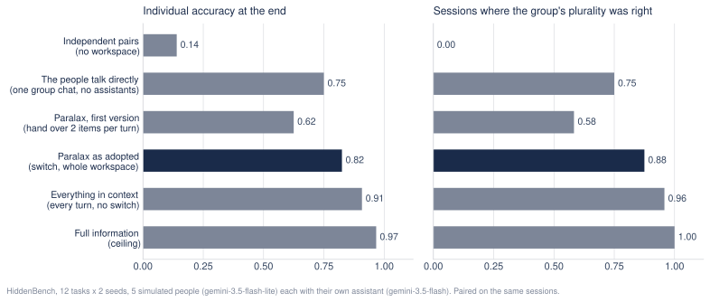

---

## 8b. The process, one session: where should the festival evacuate?

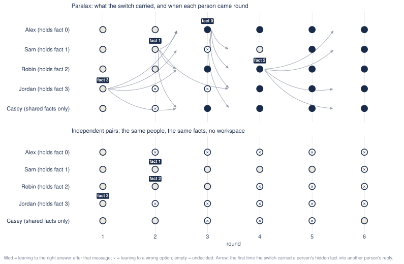

(Animated in `slides.html`: step through every message, switch decision and reply.)

- Three sites. The shared facts favour Blueberry Ridge and Red Lake and warn against Green
  Valley. Four hidden facts, one per person. Casey holds shared facts only.
- Independent pairs: Jordan rules out Blueberry Ridge alone and nobody hears it; the group
  ends split between the two wrong sites, 0 of 5.
- Paralax: Jordan states the bridge in round 1. In round 2 Sam reports the sinkhole; the
  switch carries Jordan's report into Sam's reply, which rules out both wrong sites. By round
  3 all five lean to Green Valley. Jordan's assistant asks Jordan for the timing Sam needs,
  and Jordan answers it: the ask route.

*Say:* Watch where the arrows start: always at a message that states a hidden fact. The
markers fill in one round after the arrows. Type, carry, take in.

---

## 8c. What from the workspace helped

| the reply before a person's next message had… | turns | moved to the right answer next |
|---|---|---|
| read a hidden fact held by someone else | 298 | 32% |
| read the workspace, but no hidden fact in it yet | 82 | 4% |
| switch closed | 46 | 11% |
| independent pairs, nothing to read | 574 | 3% |

---

## 8d. How much faster

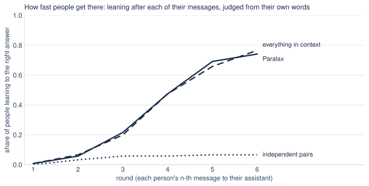

- Independent pairs: never above 7%; 93% never settle on the right answer.
- The people talking directly: faster at first (42% by round 3), 65% by round 6.
- Paralax: 22% by round 3, 74% by round 6; the median person settles in round 5.

---

## 9. What we had to take away

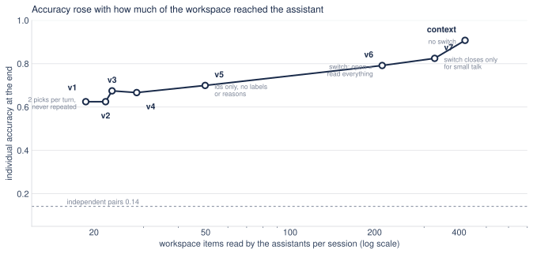

v1 handed over two items per turn: 0.63. v5 removed relation labels: 0.70. v6 made the gate a
switch that reads everything: 0.79. v7 made the switch close only for small talk: 0.83.

*Say:* Accuracy rose with how much of the workspace reached the assistant. Every piece of
machinery between the workspace and the reader cost accuracy. The one that survived is the
switch.

---

## 10. Why: delivery is not use

- With v1, people who received every hidden fact were right 54% of the time. With
  everything in context, 89%.
- Labels made it worse: items marked "contradicts" pushed people off correct leanings, and a
  model-written reason turned "if the road was cleared…" into "Jordan confirms the road was
  cleared."

---

## 11. What the switch buys

- Ten off-task messages after another person has reported a fact. Everything in context
  relayed the report 10 of 10 times; Paralax 3 of 10.

---

## 12. The Alsobay task: where Paralax falls short

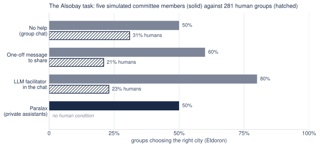

- Simulated groups unaided: 50% choose Eldoron (humans 31%). Their LLM facilitator, which did
  nothing for humans, works on simulated people: 80%.
- Paralax: about 50%. The facts reach the workspace (29 of 30 per session). People follow
  their assistant almost perfectly: 20 of 21 whose assistant favoured Eldoron chose it. But a
  third of the assistants' final replies favour the bait, with all the facts in front of them.

*Say:* This is the honest slide. The pooling works; the integration does not. The
facilitator's public scoreboard beats our private assistants on this task. So we tried to fix
integration, three ways.

---

## 13. Three attempts, and why they failed

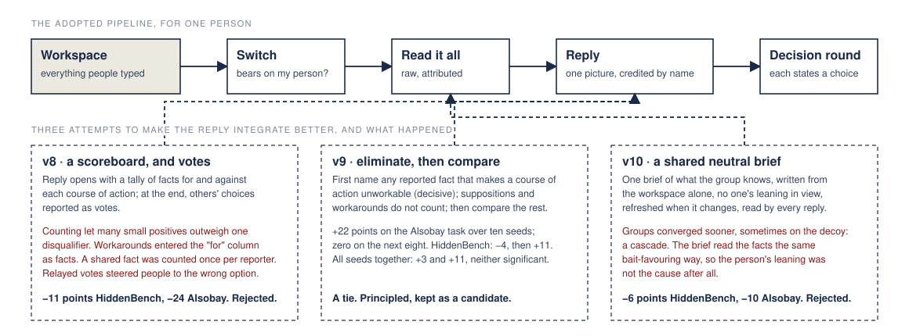

- **v8, a scoreboard and votes.** Counting let many small positives outweigh one
  disqualifier; workarounds entered the "for" column as facts; a shared fact was counted once
  per reporter; relayed votes steered people. −11 points on HiddenBench, −24 on Alsobay.
- **v9, eliminate then compare** (Tversky 1972): +22 on Alsobay over ten seeds, then zero on
  the next eight. A tie overall.
- **v10, a shared neutral brief** written without anyone's leaning in view: groups converged
  sooner, sometimes on the decoy. The brief read the facts the same bait-favouring way, so the
  person's leaning was not the cause.

---

## 14. Replicate before adopting

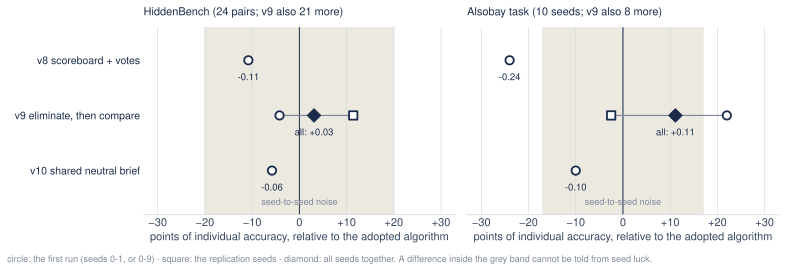

- Ten seeds of a five-person task cannot distinguish differences under about 20 points.
- v9's 22-point gain on the Alsobay task shrank to 11 on eighteen seeds (p = .19); its
  4-point HiddenBench loss became a 3-point gain on 45 pairs (p = .33). Both were seed luck of
  the same size.
- The adopted algorithm is unchanged. The open problem is the integrator's reasoning on tasks
  where facts differ in weight.

*Say:* The winner's curse is real and it is quick. Every candidate now gets replicated on both
benchmarks before anything changes.

---

## 14b. Eight people, and the relay of choices

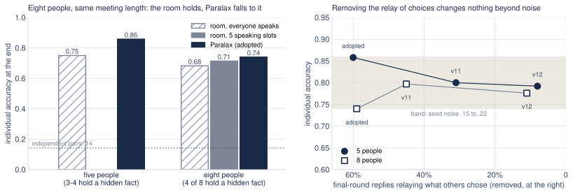

- Eight department personas, the same meeting length: the room gets the same thirty posts as
  five people had (five speaking slots a round), or everyone speaks. Four people hold a
  hidden fact, four hold only the shared facts.
- The room holds (.75 → .71, or .68 with everyone speaking). Paralax falls to it (.86 → .74,
  p = .04) with delivery intact: 86 of 94 hidden facts stated, 84 reached someone else.
- Why: 60% of final-round replies tell the person what the others chose, against the reply
  rule. With three or four holders in five, the relayed majority is right; with four in eight
  it often is not.
- Removing the relay does not help. A stronger wording (v11) halves it and is a wash; a check
  and rewrite pass (v12) removes it (8-11% of replies) and is a wash at eight, a loss at five
  and on the Alsobay task. Neither is adopted.
- A stronger reply model (gemini-3.8-flash) leaves the Alsobay numbers where they were. The
  model is not the limit.
- A persona trait meant to model human reticence moved half the people onto the right answer
  before anyone spoke. Costs of talking must be imposed structurally, never by trait text.

*Say:* This is the night after the submission. The structural claim, that private channels
beat a room as the group grows, is not shown with simulated people: they read everything and
get their facts out in thirty posts. What we found instead is a measured rule violation that
turned out not to be the cause. That is worth knowing: the next experiments are not more
reply rules.

---

## 15. Scaling

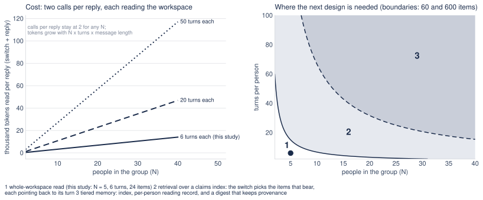

Two calls per reply at any group size; tokens grow with people × turns × message length. Up
to about 60 workspace items, read it all; up to about 600, retrieve over a claims index with
pointers to the turns; beyond, tiered memory with provenance.

---

## 16. Using the shared server

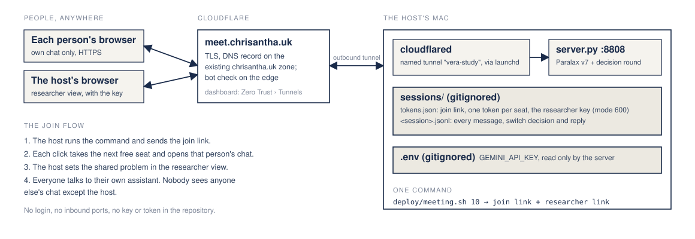

- One command on the host's Mac: `deploy/meeting.sh 10`. It prints a join link and a
  researcher link.
- The join link hands each click the next free seat and opens that person's own chat. The
  researcher link shows every chat, what each assistant read, the seat list and the box for
  the shared problem.
- Public address https://meet.chrisantha.uk, through the Cloudflare Tunnel already on the
  host's Mac: HTTPS end to end, nothing inbound, no login. Keys and tokens never leave the Mac.

*Say:* Say it out loud at the start of a session: everyone's assistant reads what everyone
types, and only the host sees everything.

---

## 17. Next steps

1. **The standing of what people type.** Replies carry workarounds, reassurances and
   recollections as reports (17-23% of replies treat an anecdote as evidence). A judge on
   the people's turns labels each as report, supposition or workaround before the reply reads
   it; measured against the anecdote rate and on both benchmarks, with replication.
2. **A scoreboard the person can see.** The in-chat facilitator wins on the Alsobay task with
   one public tally that persists across turns; a private tally inside each reply (v8)
   failed. The candidate is a tally the person keeps in view, tested against the facilitator.
3. **Costs of talking, imposed structurally.** Reading budgets and speaking slots for the
   simulated people, since trait text is not answer-neutral; then real people on the meeting
   server, where the costs are real, pre-registered on the Alsobay outcome their facilitator
   did not move.
4. **Deployment.** Sign-in and consent on the server, then Firestore and a Cloud Function
   inside BOLD OS. The algorithm does not change.

---

## 18. Take-aways

- Every assistant reading every conversation is a mediator nobody has to talk to.
- Getting facts to people is not the problem; one integrated picture is, and on hard tasks
  the integrator itself is.
- The channel should decide whether to open, and nothing else.
- Replicate on two benchmarks before adopting anything.
- A measured rule violation is not a cause until removing it changes the outcome. The relay
  of choices was real; removing it changed nothing.
- Code, prompts, ledger, talk and server: `bold-os/paralax`, branch `hack/paralax`, PR #23.

---

## References

- Alsobay, M., Rothschild, D., Hofman, J. & Goldstein, D. (2025). Bringing everyone to the
  table: an experimental study of LLM-facilitated group decision making.
  [arXiv:2508.08242](https://arxiv.org/abs/2508.08242) ·
  [GRAIL platform](https://github.com/microsoft/group_ai_lab) ·
  [data and code](https://doi.org/10.17605/OSF.IO/ERVNB)
- Diehl, M. & Stroebe, W. (1987). Productivity loss in brainstorming groups. JPSP 53.
  [doi:10.1037/0022-3514.53.3.497](https://doi.org/10.1037/0022-3514.53.3.497)
- Erman, L., Hayes-Roth, F., Lesser, V. & Reddy, D. (1980). The Hearsay-II speech-understanding
  system. ACM Computing Surveys 12. [doi:10.1145/356810.356816](https://doi.org/10.1145/356810.356816)
- Gallupe, R. B. et al. (1992). Electronic brainstorming and group size. Academy of Management
  Journal 35. [doi:10.5465/256377](https://doi.org/10.5465/256377)
- Horvitz, E. (1999). Principles of mixed-initiative user interfaces. CHI.
  [pdf](https://erichorvitz.com/chi99horvitz.pdf)
- Hu, et al. (2026). EverMemBench. [arXiv:2602.01313](https://arxiv.org/abs/2602.01313)
- Li, Y., Naito, A. & Shirado, H. (2026). HiddenBench: assessing collective reasoning in
  multi-agent LLMs via hidden profile tasks. ICML.
  [arXiv:2505.11556](https://arxiv.org/abs/2505.11556) ·
  [dataset](https://huggingface.co/datasets/YuxuanLi1225/HiddenBench)
- Lu, L., Yuan, Y. C. & McLeod, P. L. (2012). Twenty-five years of hidden profiles in group
  decision making. PSPR 16. [doi:10.1177/1088868311417243](https://doi.org/10.1177/1088868311417243)
- Marschak, J. & Radner, R. (1972). Economic theory of teams. Yale University Press.
- Mojzisch, A. & Schulz-Hardt, S. (2010). Knowing others' preferences degrades the quality of
  group decisions. JPSP 98. [doi:10.1037/a0017627](https://doi.org/10.1037/a0017627)
- Parisi, et al. (2026). Real-time group dynamics with LLM facilitation.
  [arXiv:2605.14097](https://arxiv.org/abs/2605.14097)
- Stasser, G. & Titus, W. (1985). Pooling of unshared information in group decision making.
  JPSP 48. [doi:10.1037/0022-3514.48.6.1467](https://doi.org/10.1037/0022-3514.48.6.1467)
- Tambe, M. (1997). Towards flexible teamwork. JAIR 7. [arXiv:cs/9709101](https://arxiv.org/abs/cs/9709101)
- Tversky, A. (1972). Elimination by aspects: a theory of choice. Psychological Review 79.
  [doi:10.1037/h0032955](https://doi.org/10.1037/h0032955)
